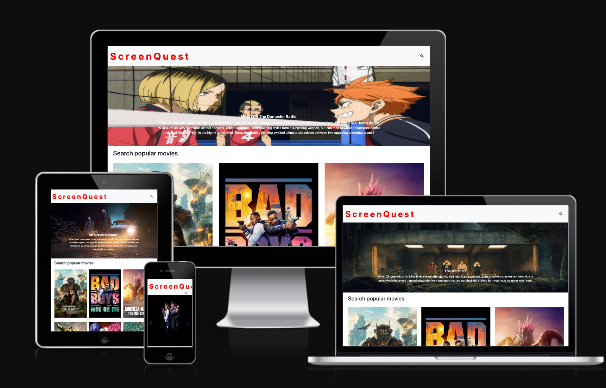
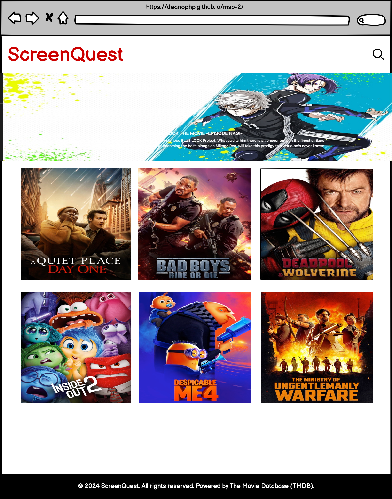
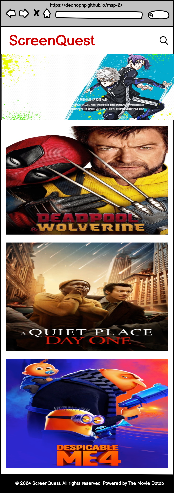
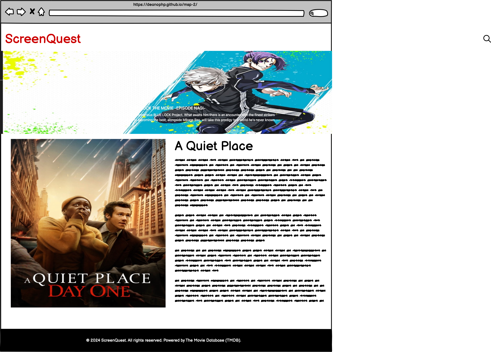
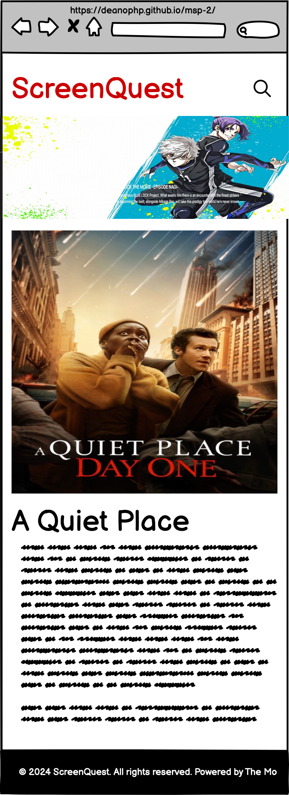

# ScreenQuest


[Click here to view the live website](https://deanophp.github.io/msp-2/)

## Overview
ScreenQuest is a dynamic and visually clean movie website that leverages The Movie Database (TMDB) API to display movie information. This document provides an overview of the website's structure, functionality, and design elements.

## User Experience (UX)

## User Stories
This section outlines the user stories that guided the development of our project. User stories help us focus on the user’s perspective and needs, ensuring that the features developed are practical and beneficial for the user.

### As a visitor
1. **As a visitor** I want to be able to easily navigate the website so I can find information easily.
2. **As a visitor** I want the website to be visually appealing and professionally styled so that I have a positive impression of the website.
3. **As a visitor** I want browse popular movies so I can discover new movies to watch.
4. **As a visitor** I want browse popular tv shows so I can discover new tv shows to watch.
5. **As a visitor** I want to browse actors or actresses
6. **As a visitor** I want to be able to click on movie, tv shows or actor/actress to get more details
7. **As a visitor** I would like to use any of my devices to view the website.

### As the site owner
1. **As the site owner**, I want to feature high-quality images and detailed descriptions of our movies, tv shows, and actors.

2. **As the site owner**, I want to display the data clearly.

3. **As the site owner**, I want to give the user clear navigation.

### As a returning user 
1. **As a returning user**, I want to be able to view saved favourite movies, tv shows, and actors.

- **Visually Appealing**
  - **Bootstrap Navbar with Hamburger Menu**: We utilized Bootstrap's responsive navbar component to ensure easy navigation across all device sizes. The hamburger menu on smaller screens allows for a clean and uncluttered interface while providing full navigation capability.

## Implementation of User Stories
<!-- @todo Look at msp1 -->

## Features
- Responsive Navbar: A simple grey Bootstrap navbar featuring a red brand text with a Font Awesome search icon.
- Carousel: Below the navbar, a carousel displays three random movies from the TMDB API.
- Main Content Area: Displays movie posters fetched from the TMDB API, set against a white background.
- Footer: A black footer containing copyright information and attribution to TMDB.
- Search Functionality: A search icon that, when clicked, reveals a search form with options to search by movie, TV show, or actor/actress, while blurring the background for focused interaction.

## Future features
- Login in and Register functionality.
- Let a logged in user leave a review.
- Let the user save their favourite movies, tv shows.
- Give the user the ability to check movies, and tv shows by genres
- Give the user the abilty to choose between Dark/Light mode.

## Skeleton
Wireframes were designed using [Balsamiq](https://balsamiq.cloud/#)
<br><br>

### Home page
--------------
| Desktop and tablet| Mobile|
|:------------------|:------|
|  |  |

### Details page
----------------
| Desktop and tablet| Mobile|
|:------------------|:------|
|  |  |

## Technologies and Tools
- **HTML5 & CSS3**: For the basic structure and styling of the website.
- **Bootstrap**: For responsive design and layout components.
- **JavaScript & jQuery**: For dynamic content and interactivity.
- **jQuery**: For implementing the search form and animations.
- **TMDB API**: For fetching movie data.
- **Font Awesome**: For the search icon.
- **Google Fonts**: - For fonts
- **Gitpod**
- **Github**
- **Visual Studio**

## Design Overview

### Navbar
- **Style**: Simple grey background.
- **Content**:
  - Brand text in red.
  - Font Awesome search icon (`fas fa-search`).
- **Behavior**: Clicking the search icon triggers a jQuery animation that reveals a search form and blurs the background.

### Carousel
- **Position**: Directly below the navbar.
- **Content**: Displays three random movies from TMDB API.
- **Implementation**: Uses Bootstrap's carousel component.

### Main Content Area
- **Style**: White background.
- **Content**: Movie posters fetched from the TMDB API.
- **Functionality**: Dynamically updates with movie data from the API.

### Footer
- **Style**: Black background.
- **Content**:
  - © 2024 ScreenQuest. All rights reserved.
  - Powered by The Movie Database (TMDB).

### Search Functionality
- **Trigger**: Font Awesome search icon in the navbar.
- **Form Elements**:
  - Single input field for the search term.
  - Large red button matching the brand color.
  - Select options for choosing between movie, TV show, or actor/actress search.
- **Behavior**:
  - When the search icon is clicked, the form fades in.
  - Background blurs to focus on the form.
  - Additional input field fades in based on the selected search option.


### Font Choices
ScreenQuest utilizes a carefully selected combination of fonts to create a visually appealing and cohesive design. The fonts used are:

1. **Edu AU VIC WA NT Hand**
2. **Poppins**

### Edu AU VIC WA NT Hand
Edu AU VIC WA NT Hand is a playful and casual handwritten font. It is part of the Google Fonts library and is designed to evoke a sense of friendliness and approachability. 

**Why Use Edu AU VIC WA NT Hand?**
- **Playful and Casual**: This font brings a personal, handwritten touch that makes the website feel more welcoming and engaging.
- **Versatile Weight Range**: Available in multiple weights from 400 to 700, it can be used for both subtle and prominent text elements, adding a dynamic feel to the design.
- **Human Touch**: The handwritten style can make certain elements of the website, such as headings or call-to-action buttons, feel more personal and unique.

### Poppins
Poppins is a geometric sans-serif typeface that is both modern and highly legible. It features a clean and contemporary look, making it suitable for a wide range of applications.

**Why Use Poppins?**
- **Clarity and Readability**: Poppins is known for its clear and easy-to-read letterforms, making it an excellent choice for body text and user interface elements.
- **Geometric Precision**: The font's geometric shapes provide a modern and professional appearance, complementing the playful nature of Edu AU VIC WA NT Hand.
- **Broad Range of Weights and Styles**: Poppins offers a comprehensive range of weights and styles, allowing for flexibility in design and the creation of a well-structured visual hierarchy.

### Why They Work Well Together
The combination of Edu AU VIC WA NT Hand and Poppins strikes a balance between casual friendliness and modern professionalism. This pairing leverages the strengths of both fonts to create a harmonious and engaging user experience:

- **Contrast and Complement**: Edu AU VIC WA NT Hand's casual, handwritten style contrasts nicely with Poppins' clean, geometric shapes, creating a visually interesting and balanced design.
- **Enhanced User Experience**: The clear readability of Poppins ensures that users can easily consume content, while Edu AU VIC WA NT Hand adds personality and emphasis to headings and key elements.
- **Consistent Visual Hierarchy**: Using Poppins for body text and interface elements and Edu AU VIC WA NT Hand for headings and special features establishes a clear and consistent visual hierarchy, guiding users naturally through the content.

### Implementation
To implement these fonts, you can use Google Fonts for easy integration:

```h
@import url('https://fonts.googleapis.com/css2?family=Edu+AU+VIC+WA+NT+Hand:wght@400..700&family=Poppins:ital,wght@0,100;0,200;0,300;0,400;0,500;0,600;0,700;0,800;0,900;1,100;1,200;1,300;1,400;1,500;1,600;1,700;1,800;1,900&display=swap');
```

## Assistance from AI
During the development of this project, AI-powered tools were utilized to assist with including the design and implementation of a transparent navbar using Bootstrap. This assistance helped to optimize the solution and implement best practices in web development.

### Specific AI Contributions
- **3 random image for carousel** I used AI to help me get three random images from themoviedb API

```
const getThreeRandomImages = (movies, num) => {
    let shuffled = movies.sort(() => 0.5 - Math.random());
    return shuffled.slice(0, num);
};
```

## Fix
### Initial Development

Initially, the project contained multiple functions to handle different API requests:
- `getMovies()`: Fetches recent movies.
- `getTVShows()`: Fetches recent TV shows.
- `getActors()`: Fetches actor/actress information.

### Refactoring and Optimization

To improve the code maintainability and reduce redundancy, these functions were consolidated into a single, more flexible function. This new function accepts parameters to determine the type of data to fetch, resulting in cleaner and more efficient code.

### Unified Fetch Function

The unified function can be used as follows:

```javascript
function fetchData(type) {
    /**
 * Display the fetched data
 */
const displayDataFetched = async () => {
    try {
        const results = await fetchRequests(getEndpoint());

        $('.heading').html(`<h2>${global.type}</h2>`)
        if (results.results.length > 0) {
            results.results.forEach(item => {
                $('.display-results').append(`
                    <div class='col-sm-12 col-md-4 d-flex justify-content-center align-items-center'>
                        <a href='details.html?page=details&id=${item.id}&category=${global.page === null || global.page === 'movies' ? 'movie' : global.page === 'tv' ? 'tv' : 'person'}'><a>                                             
                    </div>
                `);
            });
        } else {
            $('.display-results').html('<h2>No results found for popular movies</h2>')
        }
    } catch (error) {
        console.error(error.message);
    }
}

const getEndpoint = () => {
    if (global.page === null) {
        return 'movie/popular';
    } else if (global.page === 'movies') {
        return `search/movie?query=${global.params}&include_adult=false&language=en-US&page=1`;
    } else if (global.page === 'tv') {
        return `search/tv?query=${global.params}&include_adult=false&language=en-US&page=1`;
    } else {
        return `search/person?query=${global.params}&include_adult=false&language=en-US&page=1`;
    }
}
```

## Testing
[w3c Markup Validation](https://validator.w3.org/)

index.html


form-submitted.html


style.css


## Functional Testing
| Action | Expected Behaviour | Pass/Fail |
| ------ | ------------------ | --------- | 
| Initial page load | I expect the browser to load my website and be on the index section | Pass |
| Home link | The browser should navigate to and display the 'Home' section. | Pass |
| About link | The browser should navigate to and display the 'About' section. | Pass |
| The Gym link | The browser should navigate to and display the 'Gym' section. | Pass |
| Team link | The browser should navigate to and display the 'Team' section. | Pass |
| Contact link | The browser should navigate to and display the 'Contact' section. | Pass | 
| Test for hero section Button | Upon clicking the button, the Bootstrap modal should be displayed, including all its content and with the correct styling. | Pass |
| Test for team section Button | Upon clicking the button, the Bootstrap modal should be displayed, including all its content and with the correct styling. | Pass |
| Test for Contact Section Button | Implemented functionality test to verify that clicking the button in the contact section redirects to the "form-submitted.html" page when all form inputs are filled out as expected. | Pass |
| Test Full Name required | Implemented functionality to verify whether form would submit if the input field is empty | Pass | 
| Test Email required | Implemented functionality to verify whether form would submit if the input field is empty | Pass | 
| Test Tel required | Implemented functionality to verify whether form would submit if the input field is empty | Pass | 
| Test Message required | Implemented functionality to verify whether form would submit if the input field is empty | Pass | 
| Implement Iframe map functionality | Added functionality test to ensure that the iframe map in the contact section functions correctly, displaying the map as expected and allowing interaction with it. | Pass |

## Lighthouse report
<hr>

## Deployment
<hr>

1. **Design the Website on GitPod**:
   - Open GitPod and create a new workspace.
   - Design and develop your website within the GitPod environment.

2. **Push the Website to GitHub**:
   - Initialize a Git repository in your GitPod workspace:
     ```sh
     git init
     ```
   - Add all the project files:
     ```sh
     git add .
     ```
   - Commit the changes with a meaningful message:
     ```sh
     git commit -m "Initial commit"
     ```
   - Add your GitHub repository as a remote:
     ```sh
     git remote add origin <your-github-repo-url>
     ```
   - Push the changes to GitHub:
     ```sh
     git push -u origin main
     ```

## Cloning this repository

1. Open your prefered terminal.

2. Navigate to the directory where you want the cloned directory to be added.

3. Run the following command 
```sh
git clone https://github.com/DeanoPHP/MSP-1.git
```

4. After cloning, navigate into the directory
```sh
 cd your-repository-name
```

5. Now you can start working on the project on your local machine.

## Forking this repository
1. Go to the repository on GitHub.

2. In the top-right corner of the page, click the "Fork" button.

3. Once the repository has been forked, you will be taken to your copy of the repository in your GitHub account.

4. Clone your forked repository to your local machine:
```sh
git clone https://github.com/DeanoPHP/MSP-1.git
```

5. Navigate to the cloned directory
```sh
  cd your-repository-name
```

6. You can now make changes to your fork and submit pull requests to the original repository.

## Deployment Steps
<hr>

**Deploy to GitHub Pages**:
   - Go to your GitHub repository on GitHub.
   - Navigate to the repository settings.
   - Scroll down to the "GitHub Pages" section.
   - Under "Source", select the branch you want to deploy (usually `main` or `gh-pages`).
   - Click "Save".

Your website should now be live on GitHub Pages. You can access it via the URL provided in the GitHub Pages section of your repository settings.

## Credits and Acknowledgments
<hr>
I would like to express my heartfelt gratitude to my mentor for his invaluable guidance and advice throughout this project. 

Additionally, I extend my sincere thanks all my tutors for their exceptional teaching and encouragement. Your dedication and expertise have greatly contributed to my learning journey, Thank you.


